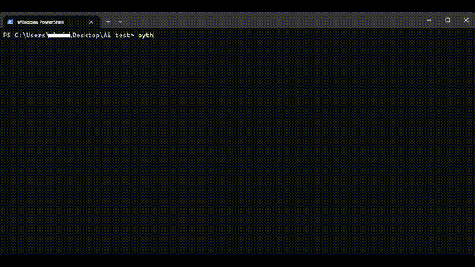

# BotOnTalkwithstrangers.com
This is an script i made for fun. It uses an AI model from ollama, dolphin-mistral. https://ollama.com/library/dolphin-mistral  What it does it opens an undetected_chromedriver window and from there it reads and talks with strangers. You can change the ai prompt how you like it. When it opens the windows make sure too decline or accept the cookies. So the bot will be able to read and talk.

You need ollama for it to run Download ollama --> https://ollama.com/download

The model I use --> https://ollama.com/library/dolphin-mistral

But of course you can select your own ollama models or other things you prefer. But for me dolphin-mistral works fine.

**Demo, not perfect**



Download the model
```bash
ollama pull dolphin-mistral
# or you can run the model so you can test if it works with = ollama run dolphin-mistral
# of course you can choose any ollama model
```

After you downloaded ollama and the model you will need to have ollama run in the background with
```bash
ollama serve
```

You need to have all the library installed
```bash
pip install undetected-chromedriver selenium ollama
```

This are all the libraries you need for the code to work.
I did have to filter the bot to 18 but of course you are free to edit everything you need or wan't to edit.

# How to run it
**Windows**
```bash
git clone https://github.com/ermwhatesigma/BotOnTalkwithstrangers.com
#or you can dowload and then unzip the file
cd BotOnTalkwithstrangers.com
pip install -r requirements.txt #if you didn't install the packages already
# or just use the command directly --> pip install undetected-chromedriver selenium ollama
python ai2-18.py
#or python3 ai-18.py
#Make sure ollama is already running in background with
ollama serve
```

Linux
```bash
git clone https://github.com/ermwhatesigma/BotOnTalkwithstrangers.com
#or you can dowload and then unzip the file
pip install undetected-chromedriver selenium ollama
cd BotOnTalkwithstrangers.com
python ai2-18.py
#or python3 ai-18.py
#Make sure ollama is already running in background with
ollama serve
```

**Chat logs appear in terminal and won't be cleared**

Note: Fixed the spam errors.
